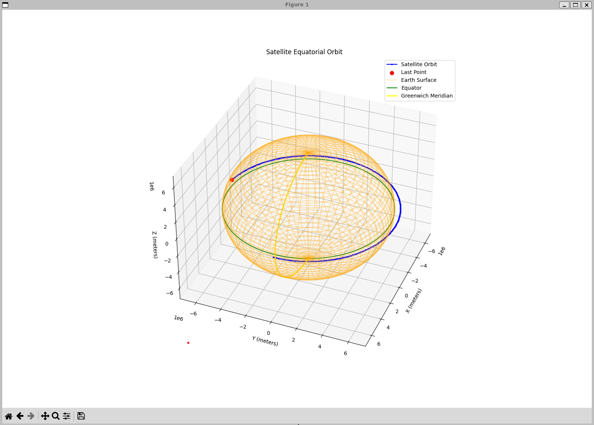

# Satellite Orbit Simulation and Visualization

This project simulates satellite orbits and visualizes them in 2D and 3D using Python and C. The project includes tools to simulate satellite orbits using Keplerian elements and visualize the orbits on a map or in a 3D plot.



## Project Structure


## Requirements

- Python 3.x
- GCC (GNU Compiler Collection)
- Virtualenv

## Setup

1. **Clone the repository:**

    ```sh
    git clone <repository-url>
    cd <repository-directory>
    ```

2. **Create and activate a virtual environment:**

    ```sh
    python3 -m venv venv
    source venv/bin/activate  # On Windows use `venv\Scripts\activate`
    ```

3. **Install the required Python packages:**

    ```sh
    pip install -r requirements.txt
    ```

## Building the Project

To build the project, use the provided `Makefile`:

```sh
make
```

## Running the Simulations

### Satellite Simulation
To run the satellite simulation and visualize the orbit in 2D:

```sh
make run-satellite
```

This will compile the satellite.c file and run the plot_orbit.py script to visualize the orbit.

### Keplerian Orbit Simulation

To run the Keplerian orbit simulation and visualize the orbit in 3D:

```sh
make run-kepler
```

This will compile the kepler.c file and run the plot_orbit3d.py script to visualize the orbit.

# License
This project is licensed under the MIT License. See the LICENSE file for details.

## Acknowledgments
- Matplotlib
- Basemap