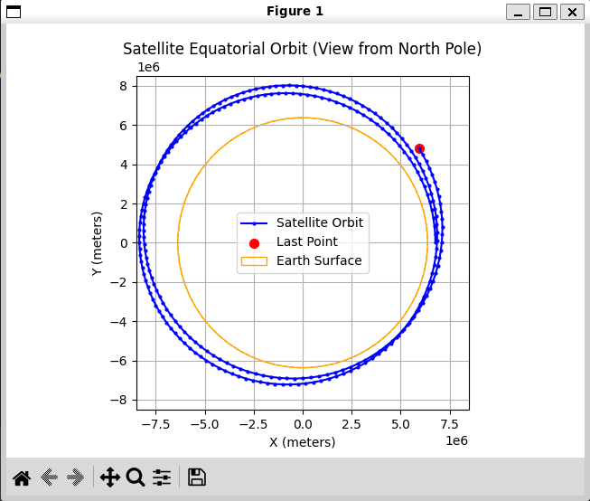
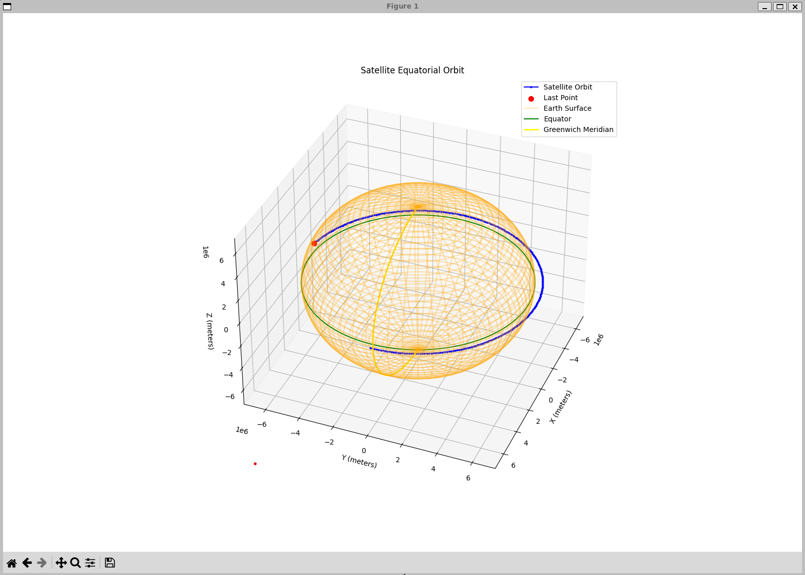
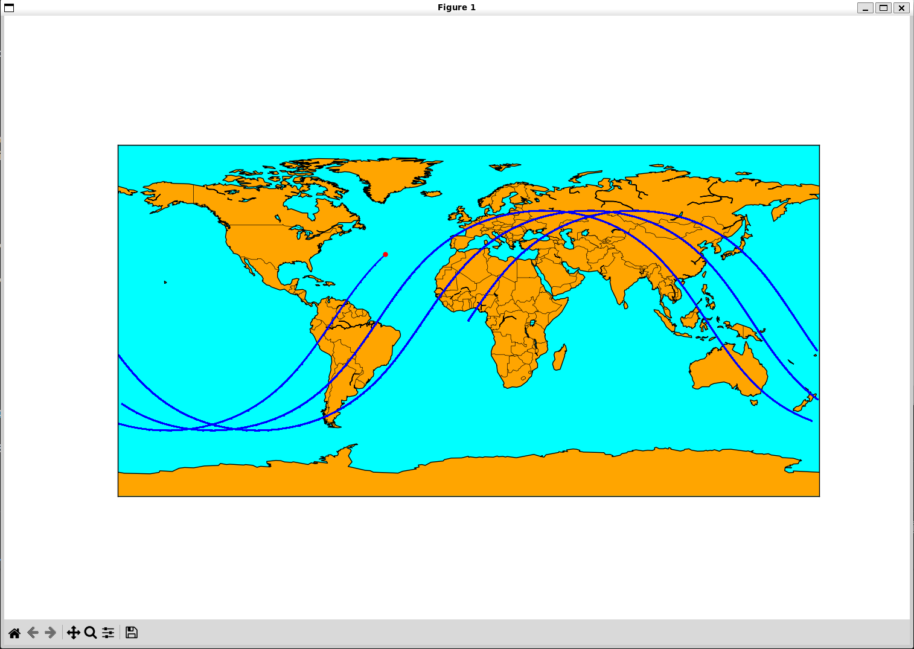

# Satellite Orbit Simulation and Visualization

This project simulates satellite orbits and visualizes them in 2D and 3D using Python and C. The project includes tools to simulate satellite orbits using Keplerian elements and visualize the orbits on a map or in a 3D plot.




## Project Structure

Two simulations are included in this project:

1. **Simple Simulation:**
    - `satellite`: C program to simulate by using simple equations of motion.

2. **Keplerian Orbit Simulation:**
    - `kepler`: C program to simulate a satellite orbit using Keplerian elements.

They output to standard output the position of the satellite at each time step. The output can be sent to a file or directly piped to the Python scripts to visualize the orbit. The format of the output is:

```
...
Step 353 | Time: 5489.33 s | Position: (X: 6766875.29 m, Y: -80820.90 m, Z: -222053.59 m) | Velocity: 7672.61 m/s
Step 353 | Time: 5504.67 s | Position: (X: 6769968.74 m, Y: -40416.60 m, Z: -111043.71 m) | Velocity: 7672.61 m/s
...
```
and

```
...
Step 353 | Time: 5280.00 s | ECI Position: (x: 6394647.16 m, y: -2020884.09 m, z: 0.00 m) | ECEF Position: (X: 5167486.09 m, Y: -4274642.95 m, Z: 0.00 m)
Step 354 | Time: 5295.00 s | ECI Position: (x: 6428377.16 m, y: -1909693.14 m, z: 0.00 m) | ECEF Position: (X: 5235927.97 m, Y: -4189990.35 m, Z: 0.00 m)
...
```

The Python scripts used to visualize the orbits are:

- `plot_orbit.py`: 2D plot of the satellite orbit.
- `plot_orbit3d.py`: 3D plot of the satellite orbit.
- `plot_map.py`: Map plot of the satellite orbit.

So you can do the following:

```sh
./satellite | python ./plot_map.py
```

or 

```sh
./kepler | ./plot_orbit3d.py
```

### Extra parameters

The C programs accept extra parameters to customize the simulation:

`satellite`: allows the following parameters:
- `-h` or `--help`: Show help message.
- `--wait`: Waits between steps to simulate real-time motion. In one minute, the satellite will move approximately one orbit (5520.00 seconds = 92 minutes).
- `--ecef`: Use Earth-Centered Earth-Fixed (ECEF) coordinates taking into account the Earth's rotation, instead of simple Cartesian coordinates.

`kepler`: allows the following parameters:
- `-h` or `--help`: Show help message.
- `--wait`: Waits between steps to simulate real-time motion. In one minute, the satellite will move approximately one orbit (5385 seconds aprox 90 minutes).
- `-e` or `--eccentricity`: Set the eccentricity of the orbit.
- `-i` or `--inclination`: Set the inclination of the orbit.
- `-w` or `--argument-of-periapsis`: Set the argument of periapsis.
- `-O` or `--longitude-of-ascending-node`: Set the longitude of the ascending node.
- `-M` or `--mean-anomaly`: Set the mean anomaly at epoch.
- `-t` or `--total-time`: Set the total simulation time.
- `-n` or `--steps`: Set the number of steps in the simulation.
- `-W` or `--wait`: Waits between steps to simulate real-time motion. In one minute, the satellite will move approximately one orbit (5380 seconds = 89.67 minutes).
- `-x` or `--example`: Use a predefined example orbit.


The python scripts accept extra parameters to customize the visualization:

`plot_orbit3d.py`: allows the `--follow` parameter to follow the satellite in the 3D plot.

`plot_map.py`: allows the following projections:
- `--mill`: Miller projection.
- `--cyl`: Cylindrical projection (this is the default).
- `--ortho`: Orthographic projection.
- `--ortho-follow`: Orthographic projection following the satellite.

## Requirements

- Python 3.x
- GCC (GNU Compiler Collection)
- Virtualenv

## Setup

1. **Clone the repository:**

    ```sh
    git clone https://github.com/jlopezr/generate-draw-orbits.git
    cd generate-draw-orbits
    ```

2. **Create and activate a virtual environment:**

    ```sh
    python3 -m venv venv
    source venv/bin/activate  # On Windows use `venv\Scripts\activate`
    ```

3. **Install the required Python packages:**

    ```sh
    pip install -r requirements.txt
    ```

## Building the Project

To build the project, use the provided `Makefile`:

```sh
make
```

## Running the Simulations

### Satellite Simulation
To run the satellite simulation and visualize the orbit in 2D:

```sh
make run-satellite
```

This will compile the satellite.c file and run the plot_orbit.py script to visualize the orbit.

### Keplerian Orbit Simulation

To run the Keplerian orbit simulation and visualize the orbit in 3D:

```sh
make run-kepler
```

This will compile the kepler.c file and run the plot_orbit3d.py script to visualize the orbit.

# License
This project is licensed under the MIT License. See the LICENSE file for details.

## Acknowledgments
- Matplotlib
- Basemap